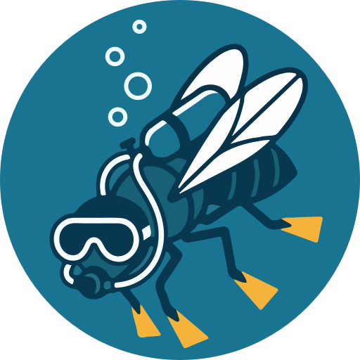

<p align="center">
  
</p>

# deeperfly

Markerless 3D pose estimation of tethered *Drosophila* from a multi-camera rig.
It estimates camera parameters and 2D/3D keypoint locations from behavioral
recordings through one linear pipeline: 2D pose → bundle adjustment →
triangulation → visualization.

deeperfly is both a command-line tool and a Python library, and a modern rewrite
of [DeepFly3D](https://github.com/NeLy-EPFL/DeepFly3D),
[DeepFly2D](https://github.com/NeLy-EPFL/DeepFly2D) and
[PyBundleAdjustment](https://github.com/semihgunel/PyBundleAdjustment).

📖 **[Documentation](https://nely-epfl.github.io/deeperfly/)**

## Installation

Install the CLI with [uv](https://docs.astral.sh/uv/):

```bash
uv tool install git+https://github.com/NeLy-EPFL/deeperfly --python 3.13 --torch-backend=auto
```

`--torch-backend=auto` picks the right PyTorch wheel for your machine.

## Usage

```bash
deeperfly doctor                        # check installation
deeperfly init config.toml              # generate a config template
deeperfly run recording/ -c config.toml # run the pipeline
deeperfly inspect recording/deeperfly_outputs/results.h5   # summarize the result
```

`deeperfly run` does everything in one command: detect 2D pose in every view,
bundle-adjust the cameras, triangulate to 3D, then render skeleton videos. By default, outputs land in `recording/deeperfly_outputs/` (override with `-o`): `results.h5`,
the rendered videos, and a snapshot of the config used. `deeperfly doctor`
reports whether the detector will run on the GPU and where the weights are
cached.

## Documentation

Full docs are at **[nely-epfl.github.io/deeperfly](https://nely-epfl.github.io/deeperfly/)**:

- [Getting started](https://nely-epfl.github.io/deeperfly/getting-started/) — run the bundled example end to end.
- [CLI usage](https://nely-epfl.github.io/deeperfly/guides/cli/) and [Writing configs](https://nely-epfl.github.io/deeperfly/guides/configuration/).
- [How it works](https://nely-epfl.github.io/deeperfly/explanation/pipeline/) — the pipeline, stage by stage.
- [Library API](https://nely-epfl.github.io/deeperfly/guides/library/) and the complete [reference](https://nely-epfl.github.io/deeperfly/reference/api/).
- [CONTRIBUTING.md](CONTRIBUTING.md) — development install, tests, linting.

## License

GPL-3.0-only. See [LICENSE](LICENSE).
