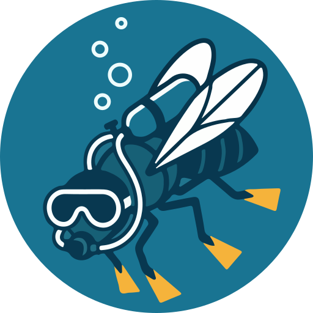

<p align="center">
  
</p>

# deeperfly

Markerless 3D pose estimation of tethered *Drosophila* from a multi-camera rig.
It estimates camera parameters and 2D/3D keypoint locations from behavioral
recordings through one linear pipeline: 2D pose → bundle adjustment →
triangulation → smoothing → corrections → joint angles → visualization.

The detector is dense: it predicts all 38 points of the `fly38` skeleton — six 5-point
legs, two antennae, the neck and a 5-point dorsal-midline abdomen chain — in *every*
view. The packaged config describes an 8-camera rig, and a run narrows itself to the
footage it actually finds.

deeperfly is both a command-line tool and a Python library, and a modern rewrite
of [DeepFly3D](https://github.com/NeLy-EPFL/DeepFly3D),
[DeepFly2D](https://github.com/NeLy-EPFL/DeepFly2D) and
[PyBundleAdjustment](https://github.com/semihgunel/PyBundleAdjustment).

📖 **[Documentation](https://nely-epfl.github.io/deeperfly/)**

## Installation

Install the CLI with [uv](https://docs.astral.sh/uv/):

```bash
uv tool install git+https://github.com/NeLy-EPFL/deeperfly --python 3.13 --torch-backend=auto
```

`--torch-backend=auto` picks the right PyTorch wheel for your machine. Python 3.11–3.13
are supported.

The `inverse_kinematics` stage is on by default, and its solver
([QuickIK](https://nely-epfl.github.io/quickik/)) is an optional extra: it publishes no
wheels, so it builds a Rust extension and needs a Rust toolchain. Add it with
`--with "quickik @ git+https://github.com/NeLy-EPFL/quickik#subdirectory=python"` (or
`uv sync --extra ik` in a clone). Without it the stage skips with the reason logged
instead of failing the run.

### Development installation

To hack on deeperfly, install the CLI from a local clone in editable mode so
your source changes take effect without reinstalling:

```bash
git clone https://github.com/NeLy-EPFL/deeperfly
cd deeperfly
uv tool install ./ --editable --python 3.13 --torch-backend=auto
```

See [CONTRIBUTING.md](CONTRIBUTING.md) for tests, linting, and the docs site.

### Updating

Upgrade a normal install to the latest `main`:

```bash
uv tool upgrade deeperfly
```

For a development install, pull the latest source — editable code is picked up
automatically. Re-run the install command only if dependencies changed:

```bash
git pull
uv tool install ./ --editable --python 3.13 --torch-backend=auto   # only if deps changed
```

## Detector weights

**Nothing downloads at run time.** Every detector deeperfly ships is trained per project,
so the checkpoint must be on this machine before the first run: put it in a directory and
name that directory in `$DEEPERFLY_MODELS` (`os.pathsep`-separated, like `PATH`). The
config then names the checkpoint as a bare filename, which travels with the recording
where a mount point would not.

Three one-channel checkpoints ship, all predicting the `fly38` point order:
`mvt_alt8_r27_gray_fly38.pth` (`class = "mvt"`, the packaged default),
`hrnet_w32_r27_gray_fly38.pth` and `hgnetv2_b4_r27_gray_fly38.pth` (both
`class = "hrnet"`). If none resolves, the run stops with every searched directory printed,
and `deeperfly doctor` reports the same thing before you start.
See [getting started](https://nely-epfl.github.io/deeperfly/getting-started/#2-get-the-detector-weights).

## Usage

```bash
export DEEPERFLY_MODELS=/path/to/models # where the checkpoints live
deeperfly doctor                        # check installation, accelerators and weights
deeperfly init config.toml              # generate a config template
deeperfly run examples/data/ -c config.toml # run the pipeline
deeperfly inspect examples/data/deeperfly_outputs/results.h5   # summarize the result
```

`deeperfly run` does everything in one command: detect 2D pose in every view,
bundle-adjust the cameras, triangulate to 3D, smooth and correct it, fit NeuroMechFly
joint angles, then render skeleton videos. Every stage is on by default except
`pictorial_structures`. By default, outputs land in `recording/deeperfly_outputs/`
(override with `-o`): `results.h5`, the rendered videos, the bundle-adjusted
`calibration.toml`, and a snapshot of the config used.

## Documentation

Full docs are at **[nely-epfl.github.io/deeperfly](https://nely-epfl.github.io/deeperfly/)**:

- [Getting started](https://nely-epfl.github.io/deeperfly/getting-started/) — run the bundled example end to end.
- [CLI usage](https://nely-epfl.github.io/deeperfly/guides/cli/) and [Writing configs](https://nely-epfl.github.io/deeperfly/guides/configuration/).
- [How it works](https://nely-epfl.github.io/deeperfly/explanation/pipeline/) — the pipeline, stage by stage, and [the dense-38 detectors](https://nely-epfl.github.io/deeperfly/explanation/detectors/).
- [Library API](https://nely-epfl.github.io/deeperfly/guides/library/) and the complete [reference](https://nely-epfl.github.io/deeperfly/reference/api/).
- [CONTRIBUTING.md](CONTRIBUTING.md) — development install, tests, linting.

## License

GPL-3.0-only. See [LICENSE](LICENSE).
