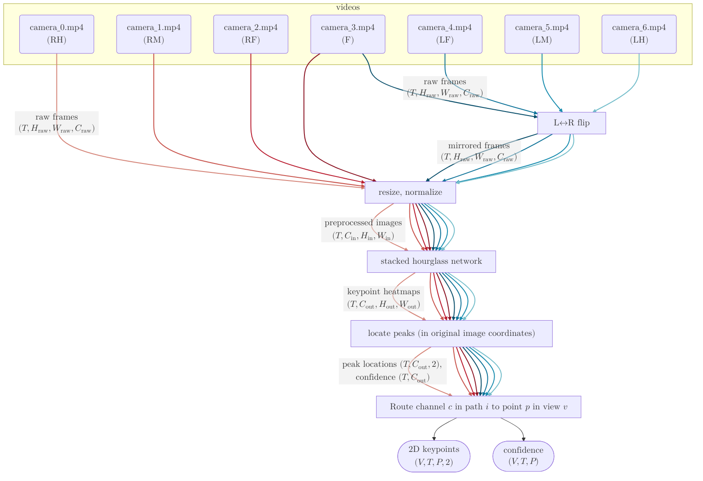
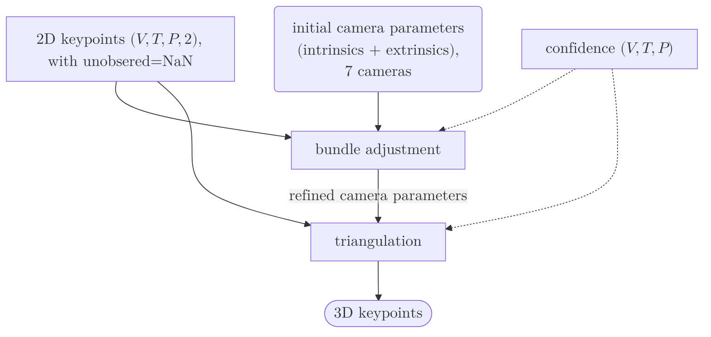

# Architecture

`deeperfly run` is one linear sequence of stages — `pose2d` →
`bundle_adjustment` → `pictorial_structures` (disabled by default) → `triangulation` →
`visualization` — each toggled by a `do_<stage>` boolean in `[pipeline]`, with its
own `[pipeline.<stage>]` parameter sub-table. Each stage writes its own group in
`poses.h5`.

## Data flow

The two diagrams below show what happens when we run deeperfly on the example dataset with the default config.

| symbol | meaning | default |
| --- | --- | --- |
| $T$ | total frames | — |
| $V$ | camera views | 7 |
| $H_\text{raw}$, $W_\text{raw}$ | raw frame size (per source) | — |
| $H_\text{in}$, $W_\text{in}$ | network input size | 256 × 512 |
| $H_\text{out}$, $W_\text{out}$ | heatmap size (stride-4 of input) | 64 × 128 |
| $C_\text{out}$ | output channels / heatmaps per model | 19 |
| $P$ | skeleton keypoints (the `P` axis in code) | 38 |
| $C_\text{raw}$, $C_\text{in}$ | RGB channels | 3 |

### Raw frames → 2D keypoints

The hourglass network was trained to output 19 heatmaps which correspond to the 19 keypoints on the right side of the fly's body. Therefore, the left cameras are mirrored to give the
detector a "right-looking" fly. The front camera (`camera_3`) feeds *two* lanes — un-flipped for
the keypoints on the right, mirrored for the left.

### 2D keypoints → 3D keypoints

## Pipeline stages

| Stage | Module | Notes |
| --- | --- | --- |
| 2D pose | `pose2d/` (`model.py`, `weights.py`) | Stacked hourglass (PyTorch) running the original DeepFly2D weights directly; CUDA / Metal automatically. |
| Calibration | `pipeline.calibrate` → `bundle_adjustment/` | Fly-as-target BA: confidence weights, Huber loss, bone-length prior; frames subsampled by `max_frames` / `frame_sampling` (`even`/`confidence`/`coverage`/`diversity`). |
| Triangulation | `triangulation.py` / `pipeline.reconstruct{,_ransac}` | NaN-aware DLT: RANSAC consensus (default), greedy reprojection-outlier rejection, or plain DLT, optionally after pictorial-structures peak recovery (`pictorial.py`). |
| Visualization | `visualization/`, `io/` | OpenCV 2D overlays + reprojected 3D skeleton, composited to MP4. |
| Result I/O | `results.py` | Self-contained HDF5 `PoseResult`. |
| Skeleton | `skeleton.py` + `data/skeleton_fly.toml` | 38 points, 10 limbs, 28 bones, per-camera visibility. |

## 3D correction: triangulation (± pictorial)

Each view is detected independently; the views only meet *geometrically*. The
reconstruction is two orthogonal choices — `run_from_points2d(...,
triangulation=..., do_pictorial=...)` for the library, or
`[pipeline.triangulation].method` + `[pipeline].do_pictorial_structures` for the
CLI:

**`triangulation`** — how the per-view 2D points become one 3D point:

- **`ransac`** (default) — triangulate each point from its largest set of
  mutually consistent views, *vetoing* a bad detection. The rig has only a handful
  of cameras, so it exhaustively enumerates all `C(V,2)` two-view hypotheses (the
  deterministic limit of RANSAC), counts inliers within `ransac_threshold` px,
  breaks ties toward lower total reprojection error, and refits from the inliers.
  A gross outlier never enters the fit; NaN views never count as inliers.
- **`greedy`** — triangulate the arg-max detections by DLT and iteratively drop
  the single worst-reprojecting view of each offending point, re-triangulating
  from the survivors (`reproj_threshold` / `max_drops`). Cheaper, but refines an
  already-contaminated fit.
- **`dlt`** — plain least-squares triangulation, no outlier handling.

**`do_pictorial_structures`** (default off; `do_pictorial=` in the library call) —
when on, first run DeepFly3D-style pictorial structures over the detector's top-K
candidate peaks (`pictorial.py`): build multi-view-consistent 3D hypotheses per
joint, then pick one per joint by exact dynamic programming along each limb under
bone-length priors (plus an optional temporal term). It can *recover* a joint when
the arg-max landed on the wrong heatmap peak (occlusion, crossing legs, L/R
confusion) — something the triangulators can only *veto*. It needs the
full-heatmap detect path (slower); its committed per-view 2D then feeds the chosen
`triangulation` (a plain `dlt` pass keeps the PS estimate). On clean recordings
it is a no-op.

## 2D detector

The detector is a faithful PyTorch copy of the original DeepFly2D stacked
hourglass: `pose2d/model.py` (`HourglassNet`, `predict_heatmaps`) and
`pose2d/weights.py` (`load_model`), behind the torch-free `pose2d/detector.py`
seam. It loads the published `sh8` weights directly, with no conversion;
`deeperfly run` downloads them on first use.
`pose2d/inference.py` preprocesses frames in torch, so a GPU-decoded frame is
normalized, resized and forwarded without leaving the GPU.

The detector uses CUDA automatically on NVIDIA and Metal (MPS) on Apple Silicon,
with no setup. For large CUDA batches the forward is wrapped with `torch.compile`
(see `pose2d/model.py`). Geometry and bundle adjustment are the
only JAX in deeperfly and run in float64 on the CPU.

## Caching and re-runs

Each stage records the config subset that produced it in `<outdir>/run.json` (a
*fingerprint*). On a re-run an enabled stage is reused while its fingerprint
still matches and its output is present; it recomputes when its parameters
changed, its output is missing, `--overwrite` selects it, or an upstream stage
recomputed (the cascade). Performance-only knobs (`batch_size`, `decode_buffer`,
`[io.image]`) never invalidate a cache. The `pose2d` cache always feeds
downstream (so `do_pose2d = false` reconstructs from a stored 2D pose); a
*derived* stage's output feeds downstream only while that stage is enabled.
