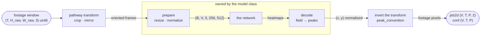
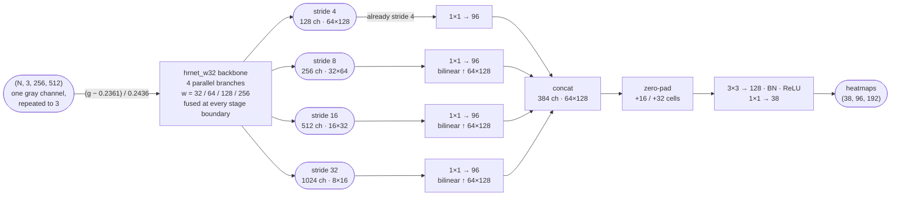
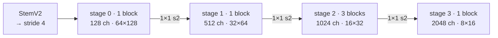
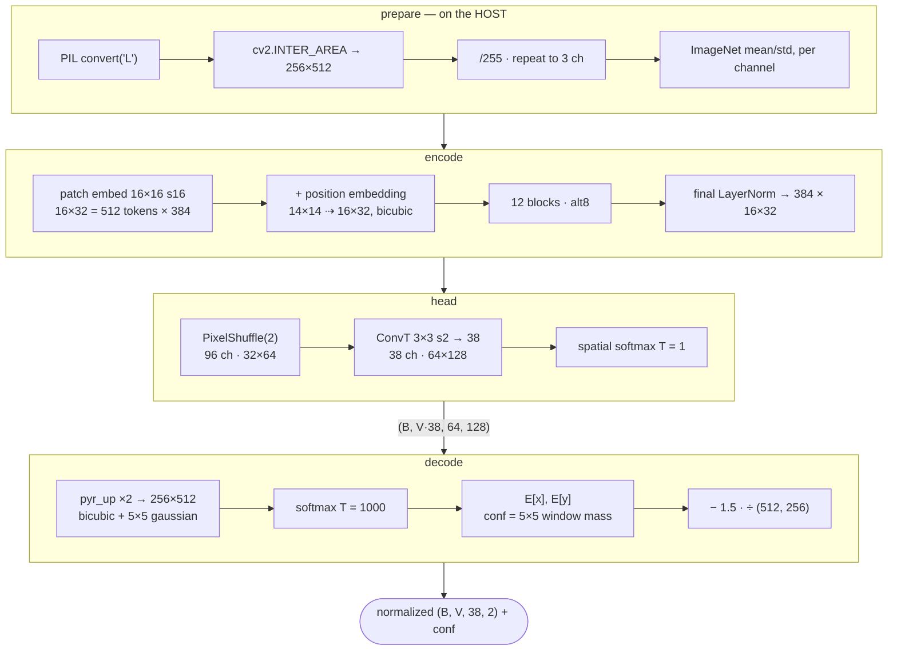

# The dense-38 detectors

Three 2D detector architectures ship with deeperfly, and all three are **dense-38**:
one heatmap channel per tracked point, in every view. That is the difference from the
19-channel one-side detector the packaged config drives (see
[Pipeline stages](pipeline.md)) — a side camera needs one pathway rather than a pathway
and a mirrored twin, and a contralateral point gets a prediction instead of a `NaN`.

| | class | head | where it wins |
| --- | --- | --- | --- |
| HRNet-W32 | `hrnet` | `concat` | most accurate |
| HGNetV2-B4 | `hrnet` | `unet` | 4× lower latency for 0.22 px |
| multiview transformer | `mvt` | — | the only one that sees all views at once |

Diagrams below are for the 256 × 512 model input every one of them takes.

## Where a detector plugs in

A detection plan is `sources → preprocessors → models → pathways`. Only three
stations belong to the architecture — input preparation, the forward, and the decode.
Everything either side is shared code in `pose2d/pathways.py` and
`pose2d/inference.py`.



`detect_sequence` stacks every pathway of one model for the same frame into
`(T, Pm, 3, H, W)` and calls `predict_points` once. That is already the right input
shape for both kinds of network: a per-view detector treats the `V` axis as spare
batch, a cross-view detector treats it as meaningful. The plan needs no new concept
for either.

## HRNet-W32, `concat` head

HRNet never throws a resolution away: four branches at strides 4, 8, 16 and 32 run
concurrently from the stem to the end, fusing at every stage boundary. That is what
makes it the most accurate arm, and also the slowest at batch 1 despite not being the
largest — four parallel branches are latency-hostile in a way parameter count does
not predict.



The four feature maps are picked out of timm's `features_only` output **by stride**,
not by index — see [below](#why-the-same-loader-runs-hgnetv2) for why that distinction
is load-bearing.

The head is the cheap part: 0.7 M of the 31.6 M parameters. The zero-pad sits
**inside** the head, before the last two convolutions, so the border cells are
produced by a convolution that has seen real features — a joint the crop cut off gets
a genuine prediction rather than an edge artifact. Zeros and not reflection:
reflecting would paste a mirrored fly exactly where the off-image joint is supposed to
be inferred.

### Why the same loader runs HGNetV2

Both dense single-view detectors load through `class = "hrnet"`. The loader is generic
over timm backbones and selects the feature maps it needs **by stride, not by index**:

```python
self._sel = tuple(red.index(r) for r in (4, 8, 16, 32))
```

`out_indices=(1,2,3,4)` is a fact about HRNet, not about backbones. HRNet alone
returns a stride-2 stem at index 0:

| backbone | maps returned | a hard-coded `(1,2,3,4)` gives |
| --- | --- | --- |
| `hrnet_w32` | s2, s4, s8, s16, s32 | strides 4 · 8 · 16 · 32 — correct |
| `hgnetv2_b4` | s4, s8, s16, s32 | strides 8 · 16 · 32 · 32 — **wrong** |

On any family that starts at stride 4 — HGNetV2, ResNet, ConvNeXt — that tuple
silently drops the heatmap-resolution map and duplicates the coarsest one (index 4
clamps back onto the last map). Nothing crashes; the model evaluates a plausible,
wrong function.

## HGNetV2-B4, `unet` decoder

HGNetV2 is Baidu's RT-DETR backbone, designed for GPU throughput rather than FLOPs.
Its block is the opposite bet from HRNet's: instead of holding four resolutions open,
it goes deep at one resolution with cheap depthwise convolutions and concatenates
every intermediate result.



Inside one block of stage 2 — six `1×1 pointwise + 5×5 depthwise` units chained, with
every output *and* the block input concatenated, then squeezed by two 1×1
convolutions. There is no residual and no ESE: the concat is the shortcut.


Because HGNetV2's stride-4 map is stage-0 output — one block deep — flattening the
four scales onto it the way the `concat` head does leaves no depth at heatmap
resolution. So this checkpoint uses the `unet` decoder instead: coarse-to-fine with
skips, two 3×3 convolutions per rung.


The stride-32 rung has no join — there is nothing coarser to upsample. Beyond that
the field and the decode are the `concat` head's exactly; only the route to the
stride-4 grid differs.

!!! warning "The head is read from the checkpoint, not defaulted"

    A `unet` checkpoint rebuilt as `concat` fails `load_state_dict` on missing
    `laterals.*` — and a caller that filters output to result rows sees an arm with no
    rows rather than an error. dfpose lost every `unet` arm of a sweep to exactly this
    before it was caught.

## The multiview transformer

The first shipped detector that is not a per-view function. A frame's views are
encoded *together*, so a joint only one camera can see informs the cameras that
cannot. The remarkable part is how little machinery that takes: the cross-view mixing
is a **reshape**, and the checkpoint has zero per-view parameters.


`attn_scopes = "llllllllglgl"`. A view-local block sees `(B·V, 512, 384)` — one view
attending to itself. A global block sees `(B, V·512, 384)`, which is 4096 tokens at
V = 8. No parameters change between the two; the schedule *is* the tensor's shape,
and the `(B·V)` axis is batch-major so the reshape groups a frame's own views.

With `view_embed = off` there is no per-view table, so the function is
permutation-equivariant over views by construction (verified to ~5e-08 on the shipped
artifact) and `V` is free: a seven-camera rig declares seven pathways and nothing else
changes. No camera name is read anywhere in the module.



Two phases run outside the GPU's comfort zone, deliberately:

- **The preparation is PIL and cv2**, so a device tensor handed to it is copied back
  down first. torch's antialiased bilinear differs from `INTER_AREA` by up to 10/255
  on ~35% of pixels — enough to move 1.8% of cells more than a model pixel, worst case
  65. `LoadedModel.prepares_on_host` is what lets `detect_sequence` leave such a
  source's window on the host instead of paying the round trip.
- **The decode is not a rounding error next to the forward.** For an 8-view frame it
  costs ≈11 ms against ≈10 ms in the network, because upsampling to the input size is
  16× the cells. `predict_points` therefore accepts a `views` argument that narrows the
  *readout* while leaving the forward untouched — bit-identical to slicing, because
  channels decode independently.

!!! warning "Views ride the channel axis"

    `forward` returns `(batch, V · K, H, W)`, not the `(B·V, K, H, W)` the head
    produced one step earlier. Same element count, so reading it the other way
    attributes every view's channels to the wrong view: channel `c` is view `c // K`,
    keypoint `c % K`. Use `heatmaps_by_view`.

!!! warning "float32 only"

    The loader refuses any other precision. bf16 autocast moved 99.6% of cells against
    fp32 on the held-out project and put 183 of 12,464 points more than a pixel out — a
    subpixel expectation over a nearly-flat ridge picks a different local peak when the
    logits wobble in the third decimal.

## Two fields, two readouts

All three return input-normalized coordinates, so a pathway inverts them identically.
What differs is what the field *covers*, and therefore what happens to a joint the
crop cut off.

**Padded — HRNet and HGNetV2.** The heatmap covers the input extended by 25% on every
side: 96 × 192 cells at stride 4 is 384 × 768 input px for a 256 × 512 input. A joint
pushed out of frame still has a cell to peak in, so `x` legitimately decodes to −0.17
or 1.12. That is an off-frame joint, not an error, and clamping it discards the only
evidence there is about where the joint went. The readout is a hard argmax plus a
parabolic fit clamped to half a cell, with **no half-cell term** — these targets were
rendered at continuous cell coordinates, unlike DeepFly2D's.

**Unpadded — the MVT.** The 64 × 128 field is upsampled twice to exactly 256 × 512, so
a peak can never leave the input; a cut-off joint saturates toward the border instead.
The readout is a soft-argmax: softmax at temperature 1000 over the whole upsampled map,
spatial expectation, then a fixed −1.5 grid-offset correction.

`LoadedModel.padded_field` is what tells `pose2d/autocrop.py` which test to run when
asking "does this crop cut the animal?". Read the wrong one and a clipping box looks
clean, because in the unpadded case the cut-off joints pile up neatly against the
border instead of leaving the box.

## Side by side

| | HRNet-W32 | HGNetV2-B4 | MVT (alt8) |
| --- | --- | --- | --- |
| class · head | `hrnet` · `concat` | `hrnet` · `unet` | `mvt` |
| parameters | 31.6 M | 15.6 M | 21.7 M |
| held-out mean error | 5.815 px | 6.028 px | not measured |
| batch-1 latency | 10.10 ms | 2.55 ms | ≈10 ms + ≈11 ms decode |
| throughput | 687 img/s | 1462 img/s | per 8-view frame |
| peak VRAM | 2.69 GiB | 1.08 GiB | — |
| views per forward | 1, `V` is spare batch | 1, `V` is spare batch | all of them, coupled |
| field | 96×192, +25% padded | 96×192, +25% padded | 64×128, unpadded |
| off-frame joint | gets a cell | gets a cell | saturates at the border |
| readout | argmax + parabola | argmax + parabola | soft-argmax on 256×512 |
| `peak_convention` | half-pixel | half-pixel | pure-scale |
| precision | bf16 / fp16 ok | bf16 / fp16 ok | float32 only |
| input prep runs | on the device | on the device | on the host |
| default batch | 16 | 16 | 2 |
| accepts gray frames | no | no | yes |

Latency and VRAM are RTX 4090, bf16, 256 × 512. The held-out figures come from a
3-fold × 3-seed comparison of 12 architectures, each fold holding out a whole animal.

!!! note "The MVT has no held-out number on purpose"

    Its artifact records `held_out_measurement: null` — it was trained on every
    recording in the export with no holdout, so there is no comparable px figure and
    none should be quoted. What it buys is structural rather than metric: coverage on
    joints no single camera can localize.

## Selecting one in a config

The dense plan is generated, not hand-written — 304 channel-to-point entries for an
8-view rig is not an edit a human should be doing:

```console
$ deeperfly dense-config -c config.toml \
    --weights .../hgnetv2_b4_fly38b.pth \
    --skeleton fly38b.toml \
    --detector hrnet            # or --detector mvt
```

The model table it stamps out:

```toml
[[pose2d.models]]
name = "dense38"
class = "hrnet"          # "mvt" for the multiview transformer
weights = ".../hgnetv2_b4_fly38b.pth"
input_size = [256, 512]
mean = 0.0               # the checkpoint carries its own mean/std and applies them
n_out_channels = 38
```

`mean` must be `0.0` for all three — each carries its own normalization constants, and
a config that also subtracted DeepFly2D's 0.22 would shift every input by a quarter of
its range with nothing to notice. The MVT additionally requires
`precision = "float32"`. Both are refused at load time rather than honored.
