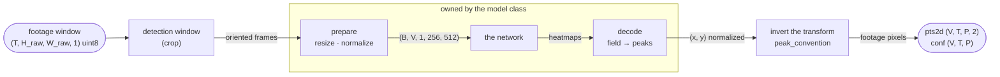
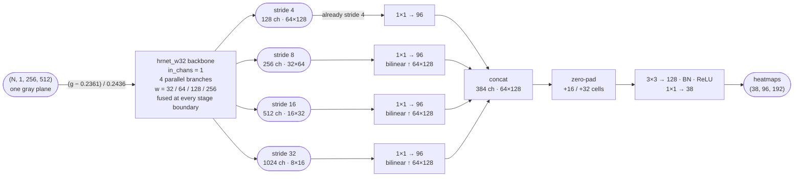
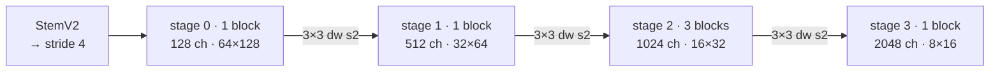
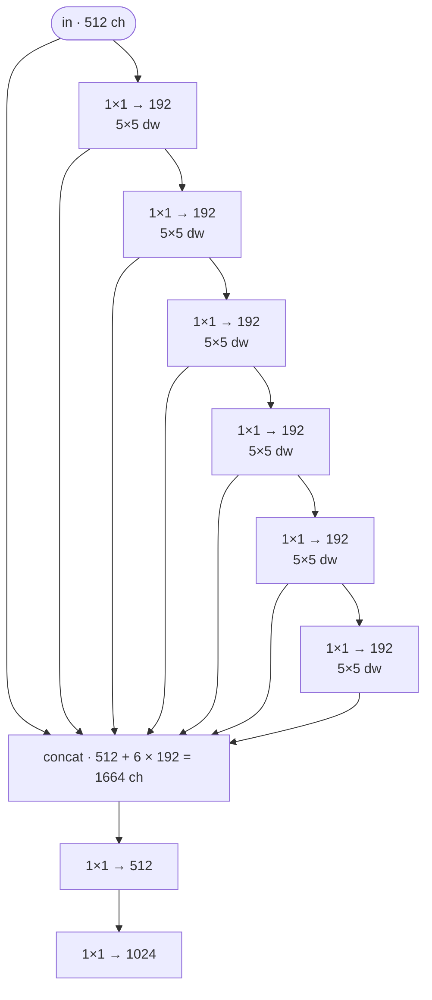
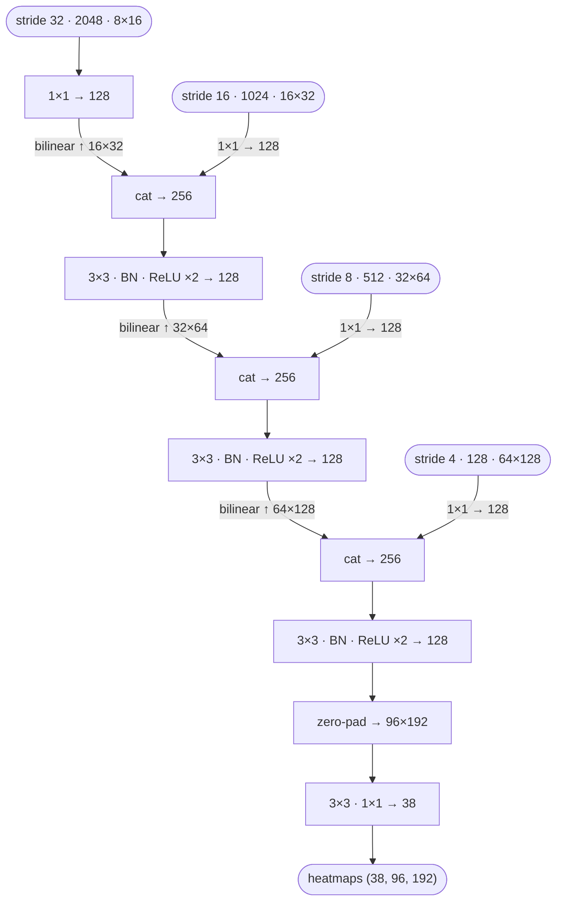
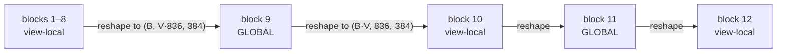
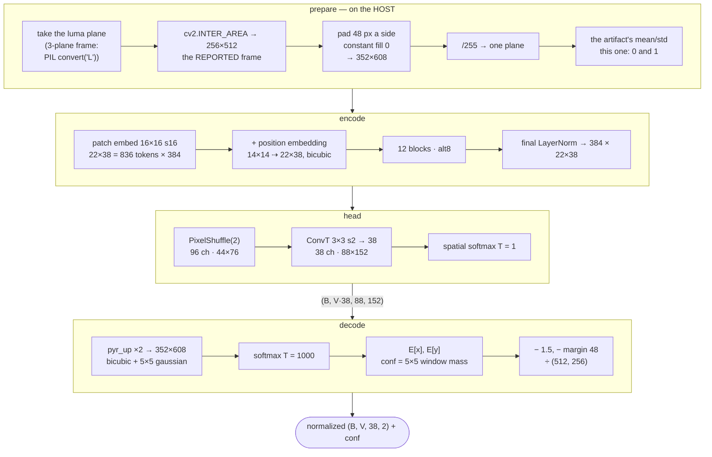

# The dense-38 detectors

Two 2D detector classes ship, and both are **dense-38**: one heatmap channel per tracked
point, in every view. That is what lets a camera be served by one pathway rather than a
pathway and a mirrored twin, what gives a contralateral point a prediction instead of a
`NaN`, and what removes the routing table — channel *i* is point *i* of the pathway's view.

| | class | head | what it is for |
| --- | --- | --- | --- |
| multiview transformer | `mvt` | — | the packaged default: a frame's views are encoded *together* |
| HRNet-W32 | `hrnet` | `concat` | the accurate per-view arm |
| HGNetV2-B4 | `hrnet` | `unet` | the cheap per-view arm |

The class name is **refused rather than defaulted**. `models.class_defaults` knows `hrnet`,
`hrnet_timm`, `mvt` and `multiview_transformer`, and a config naming anything else stops with
the list of what this build has:

```
ValueError: unknown detector class 'hourglass'; this build has
['hrnet', 'hrnet_timm', 'multiview_transformer', 'mvt']
```

That is deliberate. A class that fell back inherited *another* network's defaults — a
19-channel count and a 0.22 mean — and then failed at load with a channel-count mismatch,
which says nothing about the word that was actually wrong.

Diagrams below are for the 256 × 512, **one-plane** *reported frame* every one of them
works in. The shipped MVT pads that to 352 × 608 inside its own preparation (see
[Two fields, two readouts](#two-fields-two-readouts)); the padding is internal, so the
coordinate system in the diagrams is unchanged.

## What ships { #checkpoints }

Three checkpoints, all one-channel, all recording the `fly38` point order, all trained on the
same **55 recordings** — the two `hrnet` arms on **465 moments / 138,708 label cells**, the
MVT on those recordings after a further round of labeling, **485 / 144,775** — every
recording carrying a rig traceable to hand labels:

| file | class · head | bytes | sha256 |
| --- | --- | --- | --- |
| `mvt_r28_pad48_gray_fly38.pth` | `mvt` | 86,082,205 | `ae482d3a…` |
| `hrnet_w32_r27_gray_fly38.pth` | `hrnet` · `concat` | 127,076,045 | `13ceb937…` |
| `hgnetv2_b4_r27_gray_fly38.pth` | `hrnet` · `unet` | 62,452,371 | `fa427062…` |

Each lives in its own directory — the two `hrnet` checkpoints under
`/mnt/upramdya/data/TL/deeperfly-models/260819_*`, the MVT under
`260825_mvt_r28_pad48_gray_fly38` — beside a `README.md`, a `SHA256SUMS` and the
`fly38.toml` it was trained against, so
`sha256sum -c SHA256SUMS` is the check, and the skeleton travels with the weights rather
than being asserted about them.

**Nothing downloads.** Every detector deeperfly runs is trained per project, so `weights` is
required and is resolved on this machine: point `$DEEPERFLY_MODELS` at the directory (several,
`os.pathsep`-separated, like `PATH`) and name the checkpoint as a bare filename.
`deeperfly doctor` reports exactly that decision — the variable, every directory searched with
what is in it, and whether the checkpoint the default config names turns up:

```
weights
  DEEPERFLY_MODELS  unset -- set it to the directory holding the checkpoints
  searched [0]      /home/tlam/.cache/deeperfly/weights  (2 .pth)
  default wants     mvt_r28_pad48_gray_fly38.pth  --  NOT FOUND on the search path above
```

**The MVT is the default because it computes the views together**, so a joint only one camera
can see informs the cameras that cannot. On this rig that is not a nicety: the axial `h`
camera is the rig's only left/right bridge, so without cross-view coupling a contralateral
joint is localized in each view alone and then triangulated from one side's cameras.

Pick a per-view arm when a run detects one camera at a time, when latency matters more than
the coupling, or when a view's result must not depend on which other views were in the
tensor — with the MVT it does, by construction.

!!! note "Why the shipped checkpoints have no held-out number"

    A ship model trains on every labeled recording, so there is no animal left to hold out —
    the MVT artifact records `held_out_measurement: null` on purpose. The two per-view arms do
    carry a `val` block, but the trainer *selects the epoch on it*, so read it as "did this
    train" and not as accuracy: `hrnet_w32` 4.677 px mean / 1.808 median / 93.85% PCK@10, and
    `hgnetv2_b4` 4.968 / 1.923 / 93.49%, over the same 13,040 cells. What stands in for a
    held-out figure is the export gates — for the MVT, that permuting the views permutes the
    outputs and nothing else, that a real view's output is unchanged by what the padding
    holds, and that the artifact rebuilds the same detector.

## Where a detector plugs in

A detection plan is one pass per camera — `footage → window → detector` — synthesized
from the camera table rather than declared. Only three stations belong to the
architecture: input preparation, the forward, and the decode. Everything either side is
shared code in `pose2d/pathways.py` and `pose2d/inference.py`.



`detect_sequence` stacks every pathway of one model for the same frame into
`(T, Pm, 1, H, W)` and calls `predict_points` once. That is already the right input
shape for both kinds of network: a per-view detector treats the `V` axis as spare
batch, a cross-view detector treats it as meaningful. The plan needs no new concept
for either.

`[pose2d].batch_size` counts **images** per forward, not frames — `bs_t = batch_size // Pm`
— so the default 16 is sixteen frames for a per-view model and two eight-view frames for the
MVT. It is numerically inert either way; only dispatch changes.

## One input plane { #one-plane }

Every shipped detector takes one grayscale channel. The corpus is monochrome, so this is
not a compromise: it is the frame with the redundant copies of the luma left out.

* `LoadedModel.prepare` emits `(..., 1, H, W)`. A decoded frame arrives either as
  `(..., H, W)` from the decoder's gray fast path or as `(..., H, W, C)` whose planes are
  identical — the decoder only takes the gray path when they are — so the first channel *is*
  the image and nothing is replicated to feed a network that would take one plane back.
* HRNet's backbone is built with `in_chans=1` unconditionally, and the checkpoint loads
  `strict=True`, so a three-channel artifact fails **on the stem** rather than running.
* `mvt.ARTIFACT_FORMATS` is `("deeperfly-mvt-2",)` alone. The three-channel
  `deeperfly-mvt-1` is retired, and dropping it costs no accuracy: a `-2` is the `-1`'s
  patch-embedding stem folded onto one plane, exactly, so it is the same *function* rather
  than a retrained model.

The version has to be the guard there. A `-1` fed one plane is a shape error PyTorch would
raise; a `-2` whose scalar normalization was applied as if it were ImageNet's per-channel one
would **run**, and be quietly wrong. So the plane count is read from the artifact's own
`normalization.mean`, cross-checked against the `arch` entry, and cross-checked again against
the stem the weights actually carry — three statements of one fact, because the failure they
guard produces numbers instead of an exception.

!!! note "`accepts_gray` was a bug, and this is the fix"

    Grayscale decode is a *permission*, granted by `stream.detect_2d` only when **every**
    model in the plan declares `accepts_gray` — a detector trained through a color image must
    keep seeing one. `_HRNetPose` never declared it, so the permission was never granted for
    any `hrnet`/`hgnet` plan and those runs paid the decoder's YUV→RGB conversion, which is
    the largest single cost in a decode and thirds every byte after it. It declares it now.

## HRNet-W32, `concat` head

HRNet never throws a resolution away: four branches at strides 4, 8, 16 and 32 run
concurrently from the stem to the end, fusing at every stage boundary. That is what makes
it the more accurate of the two per-view arms, and also the more expensive at batch 1
despite not being the largest network here — four parallel branches are latency-hostile in a
way parameter count does not predict.



The `mean` and `std` on that first edge are the shipped checkpoint's own, and a
`[[pose2d.models]]` table must declare `mean = 0.0` or be refused — the model normalizes its
own input, and a config that also subtracted a second mean would shift every input by a
quarter of its range with nothing to notice.

The four feature maps are picked out of timm's `features_only` output **by stride**,
not by index — see [below](#why-the-same-loader-runs-hgnetv2) for why that distinction
is load-bearing.

The head is the cheap part: the four 1×1 laterals plus the head are 0.63 M of the model's
31.5 M parameters. The zero-pad sits **inside** the head, before the last two convolutions,
so the border cells are produced by a convolution that has seen real features — a joint the
crop cut off gets a genuine prediction rather than an edge artifact. Zeros and not reflection:
reflecting would paste a mirrored fly exactly where the off-image joint is supposed to be
inferred.

### Why the same loader runs HGNetV2

Both per-view detectors load through `class = "hrnet"`. The loader is generic over timm
backbones and selects the feature maps it needs **by stride, not by index**:

```python
WANT_REDUCTIONS = (4, 8, 16, 32)
self._sel = tuple(red.index(r) for r in WANT_REDUCTIONS)
```

`out_indices=(1,2,3,4)` is a fact about HRNet, not about backbones — HRNet returns a
stride-2 stem at index 0, and plenty of families do not:

| backbone | maps `features_only` returns | index 1 is | `(1,2,3,4)` gives |
| --- | --- | --- | --- |
| `hrnet_w32` | s2 · s4 · s8 · s16 · s32 | stride 4 | 4 · 8 · 16 · 32 — correct |
| `hgnetv2_b4` | s4 · s8 · s16 · s32 | stride 8 | **`IndexError`** — there is no index 4 |

ResNet and EfficientNet expose the stem too and behave like HRNet; ConvNeXt and Swin start
at stride 4 and behave like HGNetV2 (checked against timm 1.0.28). So the same index tuple
means different strides on different families, and the shape of the mistake depends only on
how it is written: off the end of the list it raises, and shifted back to fit it hands the
head **stride 8** as its heatmap grid. That one does not crash. It loads, it runs, and it
evaluates a plausible model at half the resolution the trained weights assume.

Naming the map by what it *is* also makes the refusal precise. A backbone that does not
expose all four strides is rejected at construction, saying which are missing:

```
RuntimeError: <backbone> exposes feature strides (…); the stride-4 heatmap head needs
(4, 8, 16, 32) and [16, 32] are absent
```

and the pinned-channel assertion (`128 · 256 · 512 · 1024`) is narrowed to the two HRNet
arms whose trained weights actually depend on those widths, so a new backbone is accepted on
the strength of the stride check alone.

## HGNetV2-B4, `unet` decoder

HGNetV2 is Baidu's RT-DETR backbone, designed for GPU throughput rather than FLOPs.
Its block is the opposite bet from HRNet's: instead of holding four resolutions open,
it goes deep at one resolution with cheap depthwise convolutions and concatenates
every intermediate result.



Inside one block of stage 2 — six `1×1 pointwise + 5×5 depthwise` units chained, with
every output *and* the block input concatenated, then squeezed by two 1×1
convolutions. There is no residual and no ESE: the concat is the shortcut.



Because HGNetV2's stride-4 map is stage-0 output — one block deep — flattening the
four scales onto it the way the `concat` head does leaves no depth at heatmap
resolution. So this checkpoint uses the `unet` decoder instead: coarse-to-fine with
skips, two 3×3 convolutions per rung, 1.96 M parameters of the model's 15.5 M.



The stride-32 rung has no join — there is nothing coarser to upsample. Beyond that
the field and the decode are the `concat` head's exactly; only the route to the
stride-4 grid differs.

That the two arms want *different* heads is measured, not assumed. Instrumenting the
backbones in the training repo, 95% of `hrnet_w32`'s compute happens **before** its stride-4
output, against 74% for `hrnet_w18_small_v2` and 0–4% for every other family — so the
`concat` head (1×1 laterals → bilinear → concat → one 3×3) is HRNet's own head, handing
HRNet a deep, already-high-resolution feature and handing everyone else first-stage edges.
Swapping in the `unet` decoder splits perfectly: both HRNet arms neutral-to-worse (+0.003 and
+0.202 px) and all four other families better, from −0.141 to −1.336 px. Use `concat` only
for the HRNet arms.

!!! warning "The head is read from the checkpoint, not defaulted"

    A `unet` checkpoint rebuilt as `concat` fails `load_state_dict` on missing
    `laterals.*` — and a caller that filters output to result rows sees an arm with no
    rows rather than an error. The training repo lost every `unet` arm of a sweep to exactly
    this before it was caught, and the same bug then turned up a third time in one round —
    here, in `load_hrnet`, where it would have failed at inference after the weights were
    already published.

## The multiview transformer

The one shipped detector that is not a per-view function. A frame's views are
encoded *together*, so a joint only one camera can see informs the cameras that
cannot. The remarkable part is how little machinery that takes: the cross-view mixing
is a **reshape**, and the checkpoint has zero per-view parameters.



`attn_scopes = "llllllllglgl"`. A view-local block sees `(B·V, 836, 384)` — one view
attending to itself. A global block sees `(B, V·836, 384)`, which is 6688 tokens at
V = 8. No parameters change between the two; the schedule *is* the tensor's shape,
and the `(B·V)` axis is batch-major so the reshape groups a frame's own views.

With `view_embed = off` there is no per-view table — the artifact is refused if it says
otherwise — so the function is permutation-equivariant over views by construction and `V` is
free: a seven-camera rig declares seven cameras and nothing else changes. No camera name is
read anywhere in the module. Verified on the shipped artifact: permuting eight views and
undoing the permutation moves a point by under **0.005 model pixels**.



The whole normalization of the shipped artifact is that `/255`: it was trained on one plane
with the dataset applying nothing further, so its recorded `mean`/`std` are `0.0` and `1.0`.
They are still *read from the artifact* rather than assumed, which is what makes the
plane-count cross-check above possible.

With grayscale decode granted the first step is just taking the plane; PIL's `convert("L")`
is the path a 3-plane frame takes, and the two agree here because the decoder only hands over
one plane when the three were identical. The conversion is pointwise, so doing it after the
pathway's crop rather than before is exactly equivalent.

Two phases run outside the GPU's comfort zone, deliberately:

- **The preparation is PIL and cv2**, so a device tensor handed to it is copied back
  down first. torch's antialiased bilinear differs from `INTER_AREA` by up to 10/255
  on ~35% of pixels — enough to move 1.8% of cells more than a model pixel, worst case
  65. `LoadedModel.prepares_on_host` is what lets `detect_sequence` leave such a
  source's window on the host instead of paying the round trip.
- **The decode is not a rounding error next to the forward.** It upsamples every channel to
  the full model input — 16× the cells — so for an eight-view frame it costs about as much as
  the network itself, and a caller after one camera would pay that eight times over.
  `predict_points` therefore accepts a `views` argument that narrows the *readout* while
  leaving the forward untouched — bit-identical to slicing, because channels decode
  independently, and the forward still sees every view.

!!! warning "Views ride the channel axis"

    `forward` returns `(batch, V · K, H, W)`, not the `(B·V, K, H, W)` the head
    produced one step earlier. Same element count, so reading it the other way
    attributes every view's channels to the wrong view: channel `c` is view `c // K`,
    keypoint `c % K`. Use `heatmaps_by_view`.

!!! warning "float32 only"

    The loader refuses any other precision. bf16 autocast moved 99.6% of cells against
    fp32 on the held-out project and put 183 of 12,464 points more than a pixel out — a
    subpixel expectation over a nearly-flat ridge picks a different local peak when the
    logits wobble in the third decimal. The class states `float32` for itself
    (`models.CLASS_DEFAULTS`), so it wins over `[pose2d].precision` without a config saying
    anything.

## Two fields, two readouts

Both classes return input-normalized coordinates, so a pathway inverts them identically.
What differs is what the field *covers*, and therefore what happens to a joint the
crop cut off.

**Padded — HRNet and HGNetV2.** The heatmap covers the input extended by 25% on every
side: 96 × 192 cells at stride 4 is 384 × 768 input px for a 256 × 512 input. A joint
pushed out of frame still has a cell to peak in, so `x` legitimately decodes to −0.17
or 1.12. That is an off-frame joint, not an error, and clamping it discards the only
evidence there is about where the joint went. The readout is a hard argmax plus a
parabolic fit clamped to half a cell, with **no half-cell term** — these targets were
rendered at continuous cell coordinates.

**Padded, differently — the MVT.** The shipped `mvt_r28_pad48_gray_fly38` declares
`arch.hm_margin_px = 48`, and it gets that margin by padding the network's **input**
rather than the head's output: the model takes 352 × 608 and its field is 88 × 152 at
the same stride 4. A joint the crop cuts off therefore has real cells to peak in, and
`x` decodes to −0.09 or 1.09 the same way the HRNet's does.

The distinction from the HRNet's pad is where the extra cells come from. Zero-padding a
convolutional head gives cells computed from zeros — measured reach is exactly one cell
(4 model px on the left and top, **zero** on the right and bottom), so beyond that the
pad is a per-channel constant. Padding the input instead moves the *token grid*, so every
added cell is computed from real tokens that passed through every attention block, and
attention has no kernel-width limit. Measured on a full recording: off-frame predictions
reach 43 model px, against the head-pad's 4.77 px ceiling.

None of this changes the coordinate system. `input_size` still reports the 256 × 512
**reported frame** — the margin is internal to `pose2d/mvt.py`, which pads inside
`prepare_images` and subtracts it again in `decode_points` — so the pathway crop, the crop
plan and every config are untouched. The readout is still a soft-argmax: softmax at
temperature 1000 over the whole upsampled map, spatial expectation, then a fixed −1.5
grid-offset correction, less the margin.

An artifact that declares no margin (every MVT through r27) behaves exactly as before: the
field spans the reported frame, and a cut-off joint saturates against the border about a
pixel and a half outside it.

`LoadedModel.padded_field` is what tells `pose2d/autocrop.py` which test to run when
asking "does this crop cut the animal?". Read the wrong one and a clipping box looks
clean, because in the unpadded case the cut-off joints pile up neatly against the
border instead of leaving the box.

!!! warning "The candidate path decodes as if no field were padded"

    The top-K path (`inference.detect_candidates_sequence`, reached only with
    `pictorial_structures` on) decodes through the shared `heatmap_to_points`, whose
    normalization assumes the field spans the input. For a padded field it does not: the
    HRNet's field is 1.5× its input on each axis, so a peak at the center still lands about
    right while one at the frame edge comes out ~85 model pixels off — far outside the 15 px
    (`pictorial.DEFAULT_INLIER_PX`) a candidate must reach to support a hypothesis. The MVT's
    352 × 608 against a 256 × 512 reported frame displaces less, but in the same way. It is one
    more reason that stage stays off on a dense run; `hrnet.cells_to_input_normalized` is the
    mapping it would need. `detect_candidates_sequence` now **refuses** outright when any
    model in the plan has a padded field, rather than decoding it wrongly.

## Side by side

| | HRNet-W32 | HGNetV2-B4 | MVT (alt8) |
| --- | --- | --- | --- |
| class · head | `hrnet` · `concat` | `hrnet` · `unet` | `mvt` |
| checkpoint | `hrnet_w32_r27_gray_fly38` | `hgnetv2_b4_r27_gray_fly38` | `mvt_r28_pad48_gray_fly38` |
| parameters | 31.5 M | 15.5 M | 21.5 M |
| views per forward | 1, `V` is spare batch | 1, `V` is spare batch | all of them, coupled |
| field | 96×192, +25% padded | 96×192, +25% padded | 88×152, +48 px padded |
| off-frame joint | gets a cell (reach 4 px) | gets a cell (reach 4 px) | gets a cell (reach 43 px measured) |
| readout | argmax + parabola | argmax + parabola | soft-argmax on 352×608, less the margin |
| `peak_convention` | half-pixel | half-pixel | pure-scale |
| precision | fp16 / bf16 ok | fp16 / bf16 ok | float32, enforced |
| input prep runs | on the device | on the device | on the host |
| peak VRAM at `batch_size = 16` | 1.42 GiB | 0.54 GiB | 0.26 GiB |
| probe (selection-set) mean | 4.677 px | 4.968 px | not measured |

Peak VRAM is `torch.cuda.max_memory_allocated` over a forward + decode at the packaged
`[pose2d].batch_size = 16` on an RTX 4090 — sixteen 256 × 512 images for the per-view arms at
`float16`, two eight-view frames for the MVT at `float32`. The probe column is the number the
epoch was *selected* on; see the note in [What ships](#checkpoints).

### The cross-validation that chose the two per-view arms

Both come out of a 3-fold × 3-seed comparison of 12 backbones in the training repo — 108
runs, 216 held-out evaluations, every fold holding out a whole animal. Those runs are the
previous, three-channel generation of these two checkpoints, trained on 35 recordings rather
than 55, so the numbers are facts about the *architectures* and not about the files that ship:

| arm | held-out mean | batch-1 latency | throughput |
| --- | --- | --- | --- |
| HRNet-W32 · `concat` | **5.815 px** | 10.10 ms | 687 img/s |
| HGNetV2-B4 · `unet` | 6.028 px | **2.55 ms** | **1462 img/s** |

HGNetV2 costs 0.21 px for 4× lower latency and 2.1× the throughput (RTX 4090, bf16,
256 × 512), and the round-27 checkpoints order the same way on their probe — 4.677 px against
4.968 px. Of the six families the head swap was run on, the two HRNet arms were the only ones
`concat` suited, which is the measurement above and the reason one `class` runs two
networks.

## Selecting one in a config

Two lines, because dense is what a plan *is*:

```toml
[pose2d]
model = "dense38"
models = [
    { name = "dense38", class = "hrnet", weights = "hgnetv2_b4_r27_gray_fly38.pth" },
]
```

`class` picks the network — `"hrnet"` runs both per-view detectors (see [why the same
loader runs HGNetV2](#why-the-same-loader-runs-hgnetv2)), `"mvt"` the multiview
transformer — and `weights` names the checkpoint. Nothing else is needed, and that is the
point of a dense plan: **channel *i* is point *i* of the pathway's view**, so there is
nothing to map. `n_out_channels` defaults to the skeleton's point count, and `input_size`,
the normalization and (for the MVT) the precision come from the checkpoint.

The identity is not a default any more but the **only** mapping: a detector emitting
something other than the skeleton's point count is refused at load rather than given a
table to explain itself with.

That is what removed `[pose2d.output_points]`, which used to say which channel of which
pass became which point of which view. It was not always optional: the retired 19-channel
detector predicted one body side, so each side camera ran twice and the config carried a
mapping row per channel per pass — 122 of them for the 7-view rig — which is why a command
existed to generate them. A contralateral point now arrives as a prediction to correct
rather than a gap to author, so the table has nothing left to say and a side-agnostic
checkpoint is not expressible under this schema.

## What each class refuses at load { #refusals }

A wrong detector is not a crash unless someone makes it one — every check below exists
because its failure otherwise comes out as *numbers*.

Shared, whatever the class:

* **A checkpoint recording no channel names.** A dense detector's channels *are* a skeleton,
  and a count cannot tell two apart: `fly38` and the retired DeepFly3D set (kept as
  `tests/data/fly38_deepfly3d.toml`) are both 38 points and share 32 of them, but at
  different indices — the old set put `l_abdomen0..2` at 16–18, so from index 16 on every
  channel means a different joint. Every class deeperfly ships records its names, so a
  nameless artifact is either not ours or was stripped — and the alternative to refusing is
  skipping the one check between a mis-stamped config and a fly with its limbs rearranged.
* **Channel names that are not this config's skeleton**, order included. Checked on *every*
  run, not once by a generator: a `weights` path repointed later, a `[skeleton]` swapped
  underneath, or a mapping line edited by hand are exactly the cases where a config silently
  stops meaning what it says.
* A channel count or an `input_size` disagreeing with the weights — the second because a
  mis-resized fly arrives at the wrong apparent *scale*, which is the one thing no
  augmentation undoes.
* A class that owns neither a decode nor a field description: a heatmap cannot be decoded
  without knowing whether its field spans the input.

`class = "hrnet"` additionally refuses a `mean` other than `0.0`; a backbone that does not
expose strides 4/8/16/32; the two HRNet arms if timm's feature widths ever stop being
`128 · 256 · 512 · 1024`; a head that is not `concat` or `unet`; and — via `strict=True` — a
three-channel stem. It also refuses a **cross-view** checkpoint outright (any `fusion.` /
`fuse_in.` / `fuse_out.` keys): its residual is not the identity once trained, so running it
one view at a time evaluates a different function than the one that was measured.

`class = "mvt"` additionally refuses any `precision` but `float32`; any `format` but
`deeperfly-mvt-2` (a raw Lightning `.ckpt` is not an exported artifact, and carries no point
names for the check above); a `view_embed` that is not `off`; an output layout this module does
not implement; a plane count that the `arch`, the normalization and the stem do not all agree
on; a point-name list whose length is not the channel count; and any missing or unexpected
state-dict key, reported as what is wrong with the artifact rather than as a tensor name.
