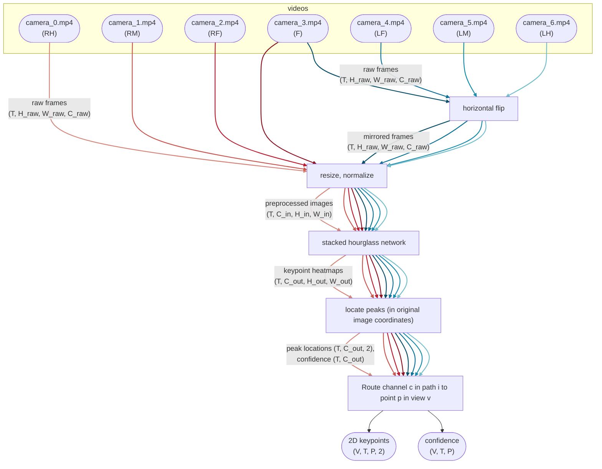
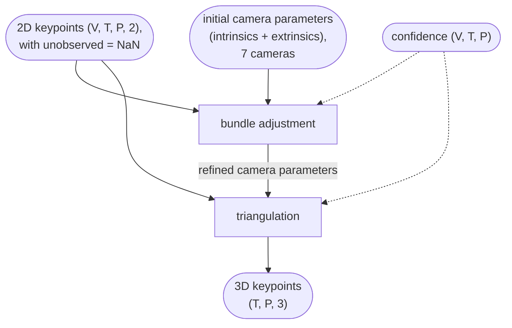

# How deeperfly works

`deeperfly run` is one linear sequence of stages — `pose2d` →
`bundle_adjustment` → `pictorial_structures` (off by default) → `triangulation`
→ `visualization`. Each stage is toggled by a `do_<stage>` boolean in
`[pipeline]`, configured by its own top-level `[<stage>]` table, and (except
`visualization`) writes its own group in `results.h5`. This page walks through what
each stage consumes and produces; the cross-cutting array layouts and terms it
uses are collected in [Conventions & glossary](conventions.md).

## Data flow

The two diagrams below show what happens when we run deeperfly on the example
dataset with the default config.

| symbol | meaning | default |
| --- | --- | --- |
| $T$ | total frames | — |
| $V$ | camera views | 7 |
| $H_\text{raw}$, $W_\text{raw}$ | raw frame size (per source) | — |
| $H_\text{in}$, $W_\text{in}$ | network input size | 256 × 512 |
| $H_\text{out}$, $W_\text{out}$ | heatmap size (stride-4 of input) | 64 × 128 |
| $C_\text{out}$ | output channels / heatmaps per model | 19 |
| $P$ | skeleton keypoints (the `P` axis in code) | 38 |
| $C_\text{raw}$, $C_\text{in}$ | RGB channels | 3 |

### Raw frames → 2D keypoints

The hourglass network was trained to output 19 heatmaps which correspond to the
19 keypoints on the right side of the fly's body. Therefore, the left cameras
are mirrored to give the detector a "right-looking" fly. The front camera
(`camera_3`) feeds *two* lanes — un-flipped for the keypoints on the right,
mirrored for the left.

### 2D keypoints → 3D keypoints

## The stages, one at a time

### 1. `pose2d` — 2D detection

- **Consumes:** the recording's footage (the `[[sources]]` globs), plus the
  detection plan (`[[pose2d.preprocessors]]` / `[[pose2d.models]]` /
  `[[pose2d.pathways]]` / `[pose2d.output_points]`).
- **Produces:** `pts2d` `(V, T, P, 2)` and `conf` `(V, T, P)`, the config camera
  rig as built at detect time, the raw image sizes, and — when
  `pictorial_structures` is enabled — the detector's top-K candidate peaks.
- **Cached in:** `pose2d/` (the whole `results.h5` is rewritten when this stage
  runs, since everything downstream derives from it).

Each pathway runs its source's frames (optionally preprocessed, e.g. mirrored)
through a stacked-hourglass network, locates the heatmap peaks, maps them back
into the raw source frame, and `[pose2d.output_points]` scatters each output
channel into its `(view, point)` slot. A `(view, point)` no pathway fills is
left `NaN` — that union *is* the visibility, with no separate mask. Frames are
streamed in fixed-size windows, so memory is constant regardless of clip length.

### 2. `bundle_adjustment` — refine the cameras

- **Consumes:** the config rig and the 2D detections (`pts2d`, `conf`), plus the
  skeleton for the bone-length prior.
- **Produces:** a refined `CameraGroup`.
- **Cached in:** `bundle_adjustment/cameras/`.

Bundle adjustment uses the fly itself as the calibration target — no external
checkerboard. It refines the camera intrinsics/extrinsics so the rig's
reprojections best agree with the detected joints, subsampling frames
(`max_frames` / `frame_sampling`) and anchoring the world gauge with the
`fixed` / `shared` parameter grammar. The solver is `scipy.optimize.least_squares`
with an analytic JAX Jacobian.

### 3. `pictorial_structures` — peak recovery (opt-in)

- **Consumes:** the cached top-K candidate peaks from `pose2d`, the skeleton, and
  the rig (BA-refined if available, else the config rig).
- **Produces:** PS-corrected `pts2d`, an initial `pts3d`, and `reproj_error`.
- **Cached in:** `pictorial_structures/`.

Off by default. When on, it reconsiders the detector's *alternative* peaks per
joint and picks the multi-view-consistent configuration under bone-length priors
— recovering a joint when the arg-max landed on the wrong peak (occlusion,
crossing legs, L/R confusion). Because it needs the candidate peaks, enabling it
re-runs `pose2d` once to extract them. See the [reconstruction
deep-dive](#3d-reconstruction-triangulation-pictorial) below.

### 4. `triangulation` — 2D → 3D

- **Consumes:** 2D points (`pictorial_structures`-corrected if that stage ran,
  else pristine `pose2d`), the rig (BA-refined if available, else config), and
  optionally `conf`.
- **Produces:** `pts3d` `(T, P, 3)`, cleaned `pts2d`, and `reproj_error`.
- **Cached in:** `triangulation/`.

Lifts the per-view 2D observations into one 3D point per joint per frame by
multi-view geometry. The `method` (`ransac` / `greedy` / `dlt`) chooses how
outliers are handled — see below.

### 5. `visualization` — render videos

- **Consumes:** the assembled result (best 2D + 3D from the enabled stages, the
  rig, the skeleton) and the footage for `imshow` panels.
- **Produces:** one MP4 per `[[visualization.videos]]` entry under `<outdir>/`.
- **Cached:** keeps no `results.h5` group; reuse is keyed on the rendered MP4s
  existing and the video specs being unchanged.

Each video is composited panel by panel (OpenCV overlays for 2D, a depth-sorted
reprojected skeleton for 3D) and streamed to an H.264 MP4 via PyAV, so a long
clip is never held in memory.

## 3D reconstruction: triangulation (± pictorial)

Each view is detected independently; the views only meet *geometrically*. The
reconstruction is two orthogonal choices — `run_from_points2d(...,
triangulation=..., do_pictorial=...)` for the library, or
`[triangulation].method` + `[pipeline].do_pictorial_structures` for the CLI:

**`triangulation`** — how the per-view 2D points become one 3D point:

- **`ransac`** (default) — triangulate each point from its largest set of
  mutually consistent views, *vetoing* a bad detection. The rig has only a
  handful of cameras, so it exhaustively enumerates all `C(V,2)` two-view
  hypotheses (the deterministic limit of RANSAC), counts inliers within
  `ransac_threshold` px, breaks ties toward lower total reprojection error, and
  refits from the inliers. A gross outlier never enters the fit; NaN views never
  count as inliers.
- **`greedy`** — triangulate the arg-max detections by DLT and iteratively drop
  the single worst-reprojecting view of each offending point, re-triangulating
  from the survivors (`reproj_threshold` / `max_drops`). Cheaper, but refines an
  already-contaminated fit.
- **`dlt`** — plain least-squares triangulation, no outlier handling.

**`do_pictorial_structures`** (default off; `do_pictorial=` in the library call)
— when on, first run DeepFly3D-style pictorial structures over the detector's
top-K candidate peaks: build multi-view-consistent 3D hypotheses per joint, then
pick one per joint by exact dynamic programming along each limb under bone-length
priors (plus an optional temporal term). It can *recover* a joint when the
arg-max landed on the wrong heatmap peak — something the triangulators can only
*veto*. It needs the full-heatmap detect path (slower); its committed per-view 2D
then feeds the chosen `triangulation` (a plain `dlt` pass keeps the PS estimate).
On clean recordings it is a no-op.

## The 2D detector

The detector is a faithful PyTorch copy of the original DeepFly2D stacked
hourglass (`pose2d/model.py`, `pose2d/weights.py`), behind the torch-free
`pose2d/detector.py` seam. It loads the published `sh8` weights directly, with
no conversion; `deeperfly run` downloads them on first use.
`pose2d/inference.py` preprocesses frames in torch, so a GPU-decoded frame is
normalized, resized and forwarded without leaving the GPU.

The detector uses CUDA automatically on NVIDIA and Metal (MPS) on Apple Silicon,
with no setup. For large CUDA batches the forward is wrapped with `torch.compile`.
Geometry and bundle adjustment are the only JAX in deeperfly and run in float64
on the CPU.

## Caching and re-runs

Each stage records the config subset that produced it in `<outdir>/run.json` (a
*fingerprint*). On a re-run an enabled stage is reused while its fingerprint
still matches and its output is present; it recomputes when its parameters
changed, its output is missing, `--overwrite` selects it, or an upstream stage
recomputed (the cascade). Performance-only knobs (`batch_size`, `decode_buffer`,
`[io.image]`) never invalidate a cache. The `pose2d` cache always feeds
downstream (so `do_pose2d = false` reconstructs from a stored 2D pose); a
*derived* stage's output feeds downstream only while that stage is enabled.

For the resume/recompute workflow from the command line see the
[CLI guide](../guides/cli.md#resuming-and-recomputing); for the exact
`run.json` / `results.h5` layout see the
[output-format reference](../reference/output-format.md).
