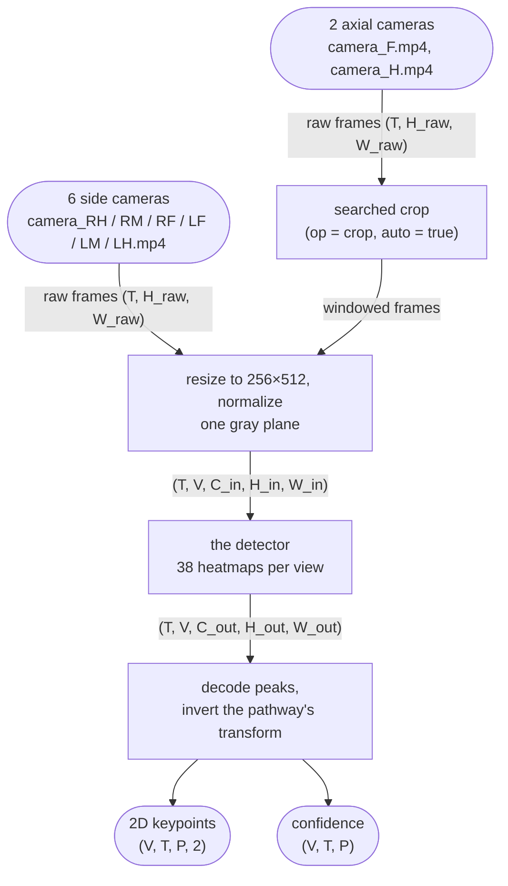
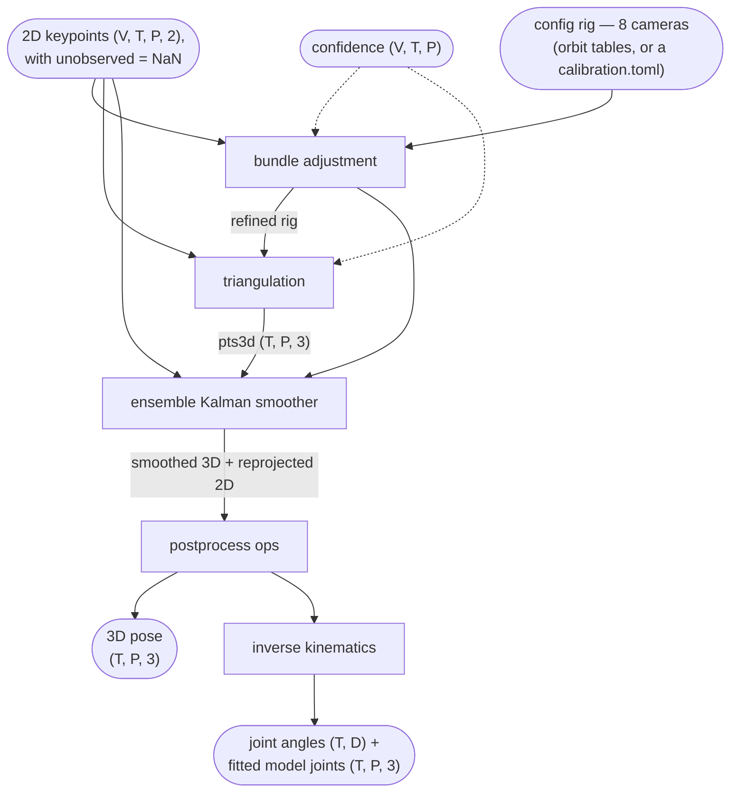

# How deeperfly works

`deeperfly run` is one linear sequence of eight stages, in the order
`deeperfly.config.STAGES` lists them:

`pose2d` → `bundle_adjustment` → `pictorial_structures` → `triangulation` → `eks` →
`postprocess` → `inverse_kinematics` → `visualization`

Each stage is toggled by a `do_<stage>` boolean in `[pipeline]`, configured by its own
top-level `[<stage>]` table, and (except `visualization`) writes its own group in
`results.h5`. This page walks through what each stage consumes and produces; the
cross-cutting array layouts and terms it uses are collected in
[Conventions & glossary](conventions.md).

## What runs when you ask for nothing { #stage-defaults }

Every stage is on by default except `pictorial_structures` (`config.STAGE_DEFAULTS`, which
is also what the packaged `[pipeline]` table writes out):

| stage | default | what it needs |
| --- | --- | --- |
| `pose2d` | on | the footage, and a checkpoint on the [weights search path](../reference/configuration.md#weights-resolution) |
| `bundle_adjustment` | on | a 2D pose |
| `pictorial_structures` | **off** | the detector's top-K candidate peaks (which costs a re-detect) |
| `triangulation` | on | a 2D pose + the rig |
| `eks` | on | a 2D pose + the rig (triangulation's 3D initializes it) |
| `postprocess` | on | a 3D pose from any of the three stages above |
| `inverse_kinematics` | on | a 3D pose + the optional [`ik` extra](../reference/configuration.md#inverse_kinematics) |
| `visualization` | on | an assembled result (+ footage for `imshow` panels) |

The smoother, the correction chain and the joint-angle fit are on because they are what a
tethered recording wants, and leaving them off meant every user rediscovering that: the
smoother is worth **-39% 3D jitter**, the chain applies what is known about the *animal* (a
thorax plate that does not move, a body that is bilaterally symmetric), and the fit is what
most downstream analysis actually reads. Each degrades rather than fails — a stage whose
input is unavailable is skipped with the reason logged, and `inverse_kinematics` skips the
same way when the optional solver is not installed, rather than costing a run that has
already paid for detection.

!!! note "Why `pictorial_structures` stays off"

    Not for symmetry with the others. It recovers a joint from the top-K peaks of a
    detector that predicted **one body side**; a dense detector already predicts every
    point in every view. Switching it on rewires `triangulation` *and* the smoother onto
    its committed 2D, which is `NaN` in every view with no candidate within 15 px
    (`pictorial.DEFAULT_INLIER_PX`) — so it would silently *un-densify* a dense run — and
    it adds a `candidates` key to the `pose2d` fingerprint, re-detecting every cached tree
    in existence.

## Data flow

The two diagrams below show what happens when we run deeperfly on the example dataset with
the default config: eight cameras, one detection pathway each, one model emitting every
tracked point for every view.

| symbol | meaning | default |
| --- | --- | --- |
| $T$ | total frames | — |
| $V$ | camera views | 8 |
| $H_\text{raw}$, $W_\text{raw}$ | raw frame size (per source) | 960 × 512 side, 1600 × 1008 axial (example rig) |
| $H_\text{in}$, $W_\text{in}$ | reported frame size | 256 × 512 (the MVT pads to 352 × 608 internally) |
| $C_\text{in}$ | input planes | 1 (grayscale) |
| $C_\text{out}$ | output channels / heatmaps per view | 38 |
| $H_\text{out}$, $W_\text{out}$ | the detector's field (per class) | 96 × 192 padded (`hrnet`), 88 × 152 padded (`mvt`) |
| $P$ | skeleton keypoints (the `P` axis in code) | 38 |

$C_\text{out} = P$ is what **dense** means, and it is why there is no routing table to
write: channel *i* is point *i* of the pathway's view. What the field *covers* is a property
of the detector class rather than of the pipeline — the single-view detectors pad the head's
output by 25% a side, the transformer pads its own input by 48 px a side, and either way a
joint the crop cut off still has a cell to peak in — see
[the dense-38 detectors](detectors.md#two-fields-two-readouts).

### Raw frames → 2D keypoints

```mermaid
flowchart TD
  side(["6 side cameras<br>camera_RH / RM / RF / LF / LM / LH.mp4"])
  axial(["2 axial cameras<br>camera_F.mp4, camera_H.mp4"])

  crop["searched crop<br>(op = crop, auto = true)"]
  prep["resize to 256×512, normalize<br>one gray plane"]
  net["the detector<br>38 heatmaps per view"]
  peak["decode peaks,<br>invert the pathway's transform"]

  out(["2D keypoints<br>(V, T, P, 2)"])
  conf(["confidence<br>(V, T, P)"])

  side -->|"raw frames (T, H_raw, W_raw)"| prep
  axial -->|"raw frames (T, H_raw, W_raw)"| crop
  crop -->|"windowed frames"| prep
  prep -->|"(T, V, C_in, H_in, W_in)"| net
  net -->|"(T, V, C_out, H_out, W_out)"| peak
  peak --> out
  peak --> conf
```

One camera, one source, one pathway, one column of the `V` axis. The six side cameras match
the framing the detector was trained through and go in whole; the two axial ones (1600 × 1008
against the side cameras' 960 × 512) do not, and get a
[searched crop](../reference/configuration.md#the-searched-crop-op-crop-auto-true)
instead — dropped in whole the fly lands too small and detection collapses to **255 px**
from the other cameras' 3D.

Two things about that lane are easy to get backwards. The **search** is a grid over
(center, width) scored by the detector's own confidence, and it needs no rig at all. What
needs a solved rig is the **accept gate**, which is reprojection agreement with the other
cameras' 3D. The gate checks its own reference before trusting it: against a nominal orbit
rig it measures that reference ~250 px out, refuses rather than choose with a broken ruler,
and falls back to confidence alone — a box ~1.7× too wide, still far better than the whole
frame. So the crop is worth having before the rig is solved, and better after: run once,
`deeperfly calibration export`, point `[cameras].calibration` at it, and the gate engages
(2.9 px blind on the hind camera, against 3.4 px for a box tuned by hand).

The `V` axis is a *batch* axis for a per-view detector and a *meaningful* one for the
multiview transformer the packaged config ships, which encodes a frame's views together so a
joint only one camera can see informs the cameras that cannot. The plan is the same either
way; only what happens inside the network changes.

### 2D keypoints → 3D pose

```mermaid
flowchart TD
  kp2d(["2D keypoints (V, T, P, 2),<br>with unobserved = NaN"])
  conf(["confidence (V, T, P)"])
  cam0(["config rig — 8 cameras<br>(orbit tables, or a calibration.toml)"])

  ba["bundle adjustment"]
  tri["triangulation"]
  eks["ensemble Kalman smoother"]
  post["postprocess ops"]
  ik["inverse kinematics"]

  kp2d --> ba
  conf -.-> ba
  cam0 --> ba

  ba -->|"refined rig"| tri
  kp2d --> tri
  conf -.-> tri

  tri -->|"pts3d (T, P, 3)"| eks
  kp2d --> eks
  ba --> eks

  eks -->|"smoothed 3D + reprojected 2D"| post
  post --> res(["3D pose<br>(T, P, 3)"])
  post --> ik
  ik --> ang(["joint angles (T, D) +<br>fitted model joints (T, P, 3)"])
```

Every geometric stage projects through the same rig — the bundle-adjusted one when that
stage ran, the config rig otherwise. Triangulation solves each frame on its own; the
smoother then fits one trajectory per keypoint to the whole recording *against the 2D
again*, which is why it sits on the observations and not only on triangulation's output.
The correction chain runs last of the three because the smoother re-derives 3D from 2D:
anything corrected before it is followed straight back off.

## The stages, one at a time

### 1. `pose2d` — 2D detection

- **Consumes:** the recording's footage (the `[[sources]]` globs), the detection plan
  (`[[pose2d.preprocessors]]` / `[[pose2d.models]]` / `[[pose2d.pathways]]`, plus
  `[pose2d.output_points]` when the identity mapping is not what is wanted), and the
  skeleton — whose ordered point names are checked against the checkpoint's own.
- **Produces:** `pts2d` `(V, T, P, 2)` and `conf` `(V, T, P)`, the config camera rig as
  built at detect time, the raw image sizes, the footage that was resolved, any searched
  crop window (in `<outdir>/autocrop.json`), and — when `pictorial_structures` is enabled —
  the detector's top-K candidate peaks.
- **Cached in:** `pose2d/` (the whole `results.h5` is rewritten when this stage runs, since
  everything downstream derives from it).

Each pathway runs its source's frames (optionally preprocessed, e.g. cropped or mirrored)
through its detector network, locates the heatmap peaks, maps them back into the raw source
frame, and scatters each output channel into its `(view, point)` slot. With a **dense**
detector that scatter is the identity — channel *i* is point *i* of the pathway's view — so
the packaged config writes no mapping at all. `[pose2d.output_points]` still exists and is
still honored; it is how a view can be fed by several pathways, and it is what a detector
whose channels mean different points in different views would need. A `(view, point)` no
pathway fills is left `NaN` — that union *is* the visibility, with no separate mask, and a
dense plan leaves none.

Both shipped classes take [**one grayscale plane**](detectors.md#one-plane). The shared
preparation (`LoadedModel.prepare`) emits `(..., 1, H, W)`, and the transformer's own host-side
preparation folds to one plane too — the shipped checkpoint records `in_channels: 1` and a
normalization of mean 0, std 1, so there is nothing to replicate to three and take back.
The decoder is allowed to hand over the luma plane it already has only when *every* model in
the plan declares `accepts_gray`; one dissenting model puts the whole plan back on RGB,
which is why that flag being absent from the single-view class was a bug rather than a
preference — grayscale decode was in effect for no `hrnet` plan at all.

[Nothing downloads](detectors.md#checkpoints). `weights` is a bare filename looked up on
`$DEEPERFLY_MODELS` (a `PATH`-like list) or an outright path, and a run that finds none
stops with the search path printed; `deeperfly doctor` prints the same search path plus
whether the default config's checkpoint resolves. An unknown `class` is refused by name
rather than falling back — a typo used to inherit the retired 19-channel detector's channel
count and mean, then fail at load with a message about channels, which says nothing about the
word that was wrong. A checkpoint recording no channel names is refused too: two 38-point
skeletons in different orders load each other's files perfectly happily and mean something
different by every index, so the names are the only real check.

Frames are streamed in fixed-size windows (`batch_size`, `decode_buffer`), so memory is
constant regardless of clip length, and an automatic crop is resolved *before* the first
frame is detected — it decides what the detector even sees.

### 2. `bundle_adjustment` — refine the cameras

- **Consumes:** the config rig and the 2D detections (`pts2d`, `conf`), plus the skeleton
  for the bone-length prior.
- **Produces:** a refined `CameraGroup`, and `<outdir>/calibration.toml`.
- **Cached in:** `bundle_adjustment/cameras/`.

Bundle adjustment uses the fly itself as the calibration target — no external checkerboard.
It refines the camera intrinsics/extrinsics so the rig's reprojections best agree with the
detected joints, subsampling frames (`max_frames` / `frame_sampling`) and anchoring the
world gauge with the `fixed` / `shared` parameter grammar. The solver is
`scipy.optimize.least_squares` with an analytic JAX Jacobian.

The packaged config fixes the intrinsics (`fixed = ["*.intr"]`), which is worth knowing
about the axial hind camera: it sits on a different lens, so both its focal length and its
distance differ from the side cameras', and with the intrinsics held a focal error is
absorbed into the distance and reported as a clean solve. Those two numbers are the example
rig's and must be measured per rig — no residual will tell you afterwards.

### 3. `pictorial_structures` — peak recovery (opt-in)

- **Consumes:** the cached top-K candidate peaks from `pose2d`, the skeleton, and the rig
  (BA-refined if available, else the config rig).
- **Produces:** PS-corrected `pts2d`, an initial `pts3d`, and `reproj_error`.
- **Cached in:** `pictorial_structures/`.

Off by default (see [above](#stage-defaults)). When on, it reconsiders the detector's
*alternative* peaks per joint and picks the multi-view-consistent configuration under
bone-length priors — recovering a joint when the arg-max landed on the wrong peak
(occlusion, crossing legs, L/R confusion). Because it needs the candidate peaks, enabling it
re-runs `pose2d` once to extract them. See the [reconstruction
deep-dive](#3d-reconstruction-triangulation-pictorial) below.

### 4. `triangulation` — 2D → 3D

- **Consumes:** 2D points (`pictorial_structures`-corrected if that stage ran, else pristine
  `pose2d`), the rig (BA-refined if available, else config), and optionally `conf`.
- **Produces:** `pts3d` `(T, P, 3)`, cleaned `pts2d`, and `reproj_error`.
- **Cached in:** `triangulation/`.

Lifts the per-view 2D observations into one 3D point per joint per frame by multi-view
geometry. The `method` (`ransac` / `greedy` / `dlt`) chooses how outliers are handled — see
below.

### 5. `eks` — smooth the trajectory

- **Consumes:** the 2D observations and `conf`, the rig, and triangulation's 3D as the
  initialization (a plain DLT inside the smoother when that stage is off).
- **Produces:** the smoothed `pts3d`, its reprojected `pts2d`, `reproj_error`, the
  per-axis `posterior_var` and the fitted `smooth_param` per keypoint.
- **Cached in:** `eks/`.

The [nonlinear multi-view ensemble Kalman smoother](../reference/configuration.md#eks) of
Lightning Pose 3D, in deeperfly's own JAX. Where triangulation solves each frame
independently, this fits **one 3D trajectory per keypoint to the whole recording**, with the
rig's own projection as the observation model. Two things follow. It **de-jitters**, because
a random-walk prior on a 3D point costs almost nothing to satisfy and per-frame detector
noise does not survive it — measured on a 100 fps eight-camera recording, median
frame-to-frame acceleration drops 39% (0.0062 → 0.0038). And it **repairs blown
detections**, because a view whose 2D disagrees with the others has its observation variance
inflated until the smoother stops believing it, so the 3D point stays on the animal and that
view's reported 2D becomes the trajectory reprojected.

What it costs is honest and small: 779 cells (0.13%) on that recording reproject more than
100 px from the detector's 2D, and every one of them is a **claw**. The latent is a position
random walk, so the accuracy gain is confined to keypoints moving no faster per frame than
the detector can localize them; a claw mid-swing lags. Turn the stage off if claw timing is
the measurement.

Its `reproj_error` means something different from the other stages': its `points` *is*
`points3d` reprojected, so the residual is measured against the `pose2d` observations
instead, and reads "how far the smoother moved from the raw detection".

### 6. `postprocess` — corrections from knowing the animal

- **Consumes:** the most-derived pose that is not its own (`eks`, else `triangulation`, else
  `pictorial_structures`) and the skeleton, which resolves the configured names to columns.
- **Produces:** the corrected `pts2d` / `pts3d`, `reproj_error`, and one report per op.
- **Cached in:** `postprocess/`.

Everything upstream estimates the pose from **pixels**; this stage applies what is known
about the **animal** instead. The packaged chain is two ops: `{ op = "static" }` collapses
the neck and the six thorax-coxa joints to one position for the whole recording (on a
tethered fly the thorax plate does not move, so everything the estimate does over time there
is per-frame noise), and `{ op = "symmetrize" }` closes the left/right gap on the body-fixed
pairs about a fitted sagittal plane — each side is triangulated from its own cameras, so a
mirror pair drifts apart by whatever the two sides' errors differ by. Never the legs: a
leg's left/right asymmetry at any instant *is* the behavior.

Keeping these priors out of the estimating stages is deliberate — an estimator already told
the answer cannot be checked against it — and so is the order. With one fitted plane
`symmetrize` is a fixed map, so `static` then `symmetrize` satisfies both properties
exactly; the other order does not. Every op logs and stores how far it moved what it
touched, which is the only check on its premise: a "static" point that had been drifting
tens of pixels was moving, and belongs out of the list rather than nailed down.

### 7. `inverse_kinematics` — 3D → joint angles

- **Consumes:** the 3D pose (`pts3d`, most-derived stage present) and the skeleton;
  optionally `conf`.
- **Produces:** joint angles `(T, D)` with their names, the fitted model's joint positions
  `(T, P, 3)` in world coordinates, and the body plan that was solved.
- **Cached in:** `inverse_kinematics/`.
- **Needs:** the optional [`ik` extra](../reference/configuration.md#inverse_kinematics).
  Without it the stage **skips** with the reason logged rather than raising — it precedes
  `visualization`, so failing here would also cost the videos after everything upstream had
  been computed and committed.

A 3D point cloud says *where* each keypoint is but not what the animal *did*: this stage
recovers the articulated pose behind it — the joint angles whose forward kinematics reach
the reconstructed keypoints.

deeperfly builds a NeuroMechFly body plan for the recording, with each leg's segment lengths
**measured from that recording** (so the fitted model has this fly's proportions and lands
on its keypoints rather than near them), plus the head and abdomen chains from geometry
baked out of the NeuroMechFly MJCF. `symmetric_segments` is on by default, giving each leg
and its mirror image the mean of the two measured lengths: a fly's left and right femurs are
the same bone, so at most one of two independently measured lengths can be anatomy — and on
the eight-view example rig they disagree by 4–6% on every femur. It constrains the *animal*,
not its pose; the two sides' joint angles stay independent, because a leg's left/right
asymmetry at any instant is the behavior. It is a prior, and it costs: every point of a leg
chain is tracked, so the chain is over-determined and the per-leg lengths already *are* the
best fit to the keypoints — sharing them on that recording raised the 3D residual 22% and the
reprojection 0.14 px in 7 of 8 views. Turn it off for the closest fit to the data; keep it on
for one animal rather than two half-animals
([the measured trade](../reference/configuration.md#ik-symmetric-segments)).

The head is *placed* from the recording too. Its three DOFs turn about the head–thorax
pivot, and the `neck` keypoint sits on that pivot — so it constrains none of the three
angles, but it says where the pivot is, which the rest of the pose cannot: the six
thorax-coxae that register the body are very nearly coplanar, and the pivot sits well above
their plane, so placing it from them alone is a long extrapolation along their
worst-determined direction. The chain is therefore put on its own measured landmark, the way
each leg is put on its measured median thorax-coxa, and its size is measured from the neck
out to the antennae rather than from the registered anchor.
[QuickIK](https://nely-epfl.github.io/quickik/) then fits the whole body at once — every
leg, the head and the abdomen against all the tracked keypoints in one solve, rather than
each limb on its own — with a toward-neutral prior pinning the DOFs the keypoints leave
undetermined and each frame warm-started from the last.

Because the fitted *joint positions* are written alongside the angles, the model reprojects
onto the raw views with the skeleton's own bones: that is what the `skeleton_nmf` and
`mesh_nmf` panels and the GUI's NMF overlays draw.

### 8. `visualization` — render videos

- **Consumes:** the assembled result (best 2D + 3D from the enabled stages, the rig, the
  skeleton) and the footage for `imshow` panels.
- **Produces:** one MP4 per `[[visualization.videos]]` entry under `<outdir>/`.
- **Cached:** keeps no `results.h5` group; reuse is keyed on the rendered MP4s existing and
  the video specs being unchanged.

Each video is composited panel by panel (OpenCV overlays for 2D, a depth-sorted reprojected
skeleton for 3D) and streamed to an H.264 MP4 via PyAV, so a long clip is never held in
memory.

A panel's `stage` key matters more now that four stages can produce a pose. Left out, it means
"the most-derived stage present" — so with the smoother and the correction chain on, a video
named `pose3d` would silently draw the *corrected* pose and one named `pose2d` would stop
showing the detector at all. Naming the stage is how each video keeps meaning one thing, and
the only way to render a before/after pair; a video naming a stage that is not in the file is
skipped with a warning rather than quietly drawn from something else.

## A run narrows itself to the footage present { #narrowing }

The packaged config describes the eight-camera rig, and a recording missing a camera is not
malformed — a project's older recordings predate the camera being added. Rather than refuse
the recording, the run narrows itself (`Config.narrowed_to_sources`), in dependency order:

- a `[[sources]]` entry that resolves no files invalidates the `[[pose2d.pathways]]` reading
  it (a source may feed several, so this is not one-to-one);
- a `[cameras.<name>]` view no surviving pathway feeds **leaves the rig** — which is what
  shortens the `V` axis. Dropping the pathway alone would leave a view whose 2D is all-`NaN`,
  which reads as a detected-and-empty camera rather than an absent one, and which bundle
  adjustment would then export into `calibration.toml` at its unrefined nominal pose with
  nothing marking it as unmeasured;
- `[pose2d.output_points]` rows naming a dropped view or pathway go with them, as does an
  `auto = true` preprocessor no surviving pathway uses (an orphaned automatic crop is
  otherwise a hard error);
- `[visualization.videos]` grid cells naming a dropped view are **blanked** rather than
  removed, so the montage keeps its shape and the remaining cameras stay where the reader
  expects them.

One warning names the source, the pathways and the views, and reports how many views the run
is proceeding on. Below `config.MIN_VIEWS_FOR_3D` (two) it refuses instead, because one view
fails *silently*: triangulation returns all-`NaN` without raising, RANSAC gives a single
observation zero inliers and then erases it, and bundle adjustment reports success at a cost
near zero.

Narrowing happens **before** the config snapshot and the fingerprints, and that ordering is
what keeps the cache honest: a run that proceeded on seven views records a seven-view
fingerprint and recomputes when the eighth camera turns up. Only the effective config
narrows — the snapshot still says what was *asked for*.

A solved rig narrows the same way from the other side: a `calibration.toml` covering only
some of the config's cameras drops the ones it never measured, names them, and proceeds on
the rest; one covering *none* of them is refused, because that is not a narrower rig but a
different one.

## 3D reconstruction: triangulation (± pictorial)

Each view is detected independently unless the detector couples them (the multiview
transformer does); the *reconstruction* is where the views meet geometrically. It is two
orthogonal choices — `run_from_points2d(..., triangulation=..., do_pictorial=...)` for the
library, or `[triangulation].method` + `[pipeline].do_pictorial_structures` for the CLI. (The
library one-shot stops at reconstruction: the smoother and the correction chain are separate
stage wrappers, `deeperfly.pipeline.stage_eks` / `stage_postprocess`, and
`deeperfly.eks.smooth` is the array-level entry point a `run_from_points2d` caller can apply
to that function's own output.)

**`triangulation`** — how the per-view 2D points become one 3D point:

- **`ransac`** (default) — triangulate each point from its largest set of mutually
  consistent views, *vetoing* a bad detection. The rig has only a handful of cameras, so it
  exhaustively enumerates all `C(V,2)` two-view hypotheses (the deterministic limit of
  RANSAC), counts inliers within `ransac_threshold` px, breaks ties toward lower total
  reprojection error, and refits from the inliers. A gross outlier never enters the fit; NaN
  views never count as inliers.
- **`greedy`** — triangulate the arg-max detections by DLT and iteratively drop the single
  worst-reprojecting view of each offending point, re-triangulating from the survivors
  (`reproj_threshold` / `max_drops`). Cheaper, but refines an already-contaminated fit.
- **`dlt`** — plain least-squares triangulation, no outlier handling.

**`do_pictorial_structures`** (default off; `do_pictorial=` in the library call) — when on,
first run DeepFly3D-style pictorial structures over the detector's top-K candidate peaks:
build multi-view-consistent 3D hypotheses per joint, then pick one per joint by exact
dynamic programming along each limb under bone-length priors (plus an optional temporal
term). It can *recover* a joint when the arg-max landed on the wrong heatmap peak —
something the triangulators can only *veto*. It needs the full-heatmap detect path (slower);
its committed per-view 2D then feeds the chosen `triangulation` (a plain `dlt` pass keeps the
PS estimate), and the smoother too. On a dense run that is a downgrade, not a no-op: a
`(view, point)` with no candidate within 15 px comes out `NaN`, and a dense detector had a
prediction there.

## Where the compute goes

Two detector classes ship, both dense: `"hrnet"` (per-view, and the loader that also runs the
HGNetV2 checkpoint) and `"mvt"` (the multiview transformer, which encodes a frame's views
together). Their architectures, fields and measured trade-offs are their own page — [the
dense-38 detectors](detectors.md).

The detector uses CUDA automatically on NVIDIA and Metal (MPS) on Apple Silicon, with no
setup, and falls back to the CPU. `[pose2d].precision` defaults to `float16`, which is CUDA
autocast and a no-op elsewhere; a class may pin it, and the multiview transformer does — it
requires `float32`, because bf16 autocast moved 99.6% of cells against fp32 on a held-out
project. That model also prepares its inputs on the *host*, reproducing its training
pipeline's cv2 resize, so `detect_sequence` leaves its windows on the CPU instead of paying a
round trip. Detection prepares the next window while the GPU still has the current one; the
render fans compositing (OpenCV, GIL-releasing) over up to 8 threads.

Geometry, bundle adjustment and the smoother are the JAX in deeperfly, and they run in
float64 on the CPU — `deeperfly.geometry` pins `JAX_PLATFORMS=cpu` and enables x64 at import.

## Caching and re-runs

Each stage records the config subset that produced it in `<outdir>/run.json` (a
*fingerprint*). On a re-run an enabled stage is reused while its fingerprint still matches
and its output is present; it recomputes when its parameters changed, its output is missing,
`--overwrite` selects it, or an upstream stage recomputed (the cascade). Performance-only
knobs (`batch_size`, `decode_buffer`, `[io.image]`) never invalidate a cache. The `pose2d`
cache always feeds downstream (so `do_pose2d = false` reconstructs from a stored 2D pose); a
*derived* stage's output feeds downstream only while that stage is enabled.

The skeleton enters every stage's fingerprint as its ordered `point_names` and `bones`, and
deliberately **not** as its name: two skeletons agreeing on both compute the same result
whatever they are called, so renaming a preset — which is what `fly38b` → `fly38` was — must
not buy a full re-detection. What a name change cannot do is make one point set readable as
another, so a run *refuses* an output directory whose stored pose is on a different point set
before it reads or computes anything (`pipeline.run._refuse_a_foreign_skeleton`). Every array
in `results.h5` is `(..., P, ...)` with no names beside it, and a resume that does not
recompute `pose2d` never rewrites that record.

Two more things carry into a fingerprint that a path alone would hide: the *content* of the
`calibration.toml` the rig points at (re-solving one rewrites it under the same name) and of
any `[eks].ensemble` member. And because a *dropped* key cannot invalidate anything under
subset comparison, a behavior change with no config key has to announce itself with one —
`IK_SOLVER_REVISION` and `EKS_REVISION` are those keys.

For the resume/recompute workflow from the command line see the
[CLI guide](../guides/cli.md#resuming-and-recomputing); for the exact `run.json` /
`results.h5` layout see the [output-format reference](../reference/output-format.md).
